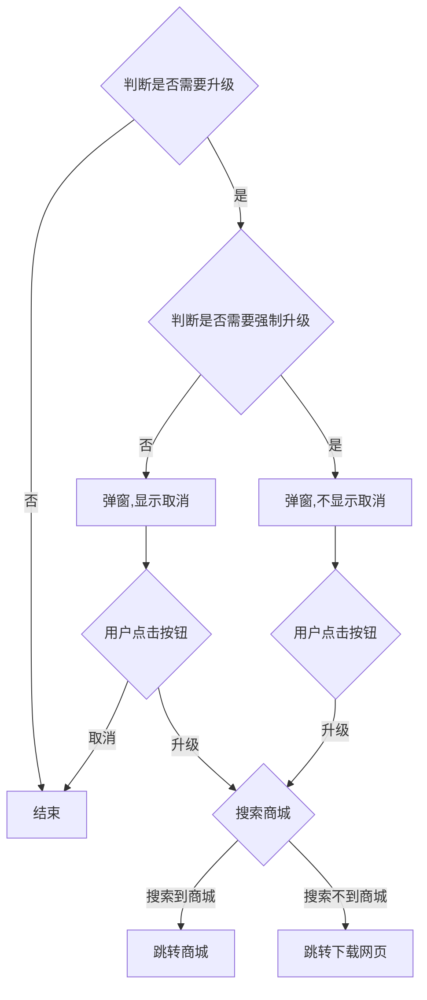

# cordova-plugin-app-update-by-app-store
跳转app商店升级应用


## 代码流程



## 1、安装
```
npm i @initmrd/app-update  
```
```
ionic cordova plugin add https://github.com/initMrD/cordova-plugin-app-update-by-app-store.git
```
## 2、将配置文件放到服务器静态资源目录下

### 各参数内容说明

- version 版本号 低于该版本提示升级
- forceVersion 强制升级版本号 低于该版本强制升级
- description 升级提示
- store 要搜索的商店列表的包名（Android only）
- downloadWeb 如果用户手机里未安装应用上架的应用商城需要跳转的页面（Android only）

### 配置文件内容

```json
{
  "ios": {
    "version": "0.0.2",
    "forceVersion": "0.0.1",
    "description": "有新的版本了，赶快来下载吧！"
  },
  "android": {
    "version": "0.0.2",
    "forceVersion": "0.0.1",
    "description": "有新的版本了，赶快来下载吧！",
    "downloadWeb": "http://192.168.0.104",
    "store": [
      "com.huawei.appmarket"
    ]
  }
}
```
## 3、项目中调用
app.module.ts
```
...
import {AppUpdateByStore} from '@initmrd/app-update';
...

@NgModule({
    ...
    providers: [
        ...
        AppUpdateByStore,
        ...
    ],
    ...
})
export class AppModule {
}
```

app.component.ts
```
...
import {AppUpdateByStore} from '@initmrd/app-update';
...

@Component({
    selector: 'app-root',
    templateUrl: 'app.component.html',
    styleUrls: ['app.component.scss']
})
export class AppComponent {
    constructor(
        ...
        private appUpdateByStore: AppUpdateByStore,
        ...
    ) {
        this.initializeApp();
    }

    initializeApp() {
        this.platform.ready().then(() => {
            ...
            this.appUpdateByStore.checkUpdate('http://192.168.0.104/update.json', () => {
                alert('success');
            }, () => {
                alert('error');
            });
            ...
        });
    }
}
```
